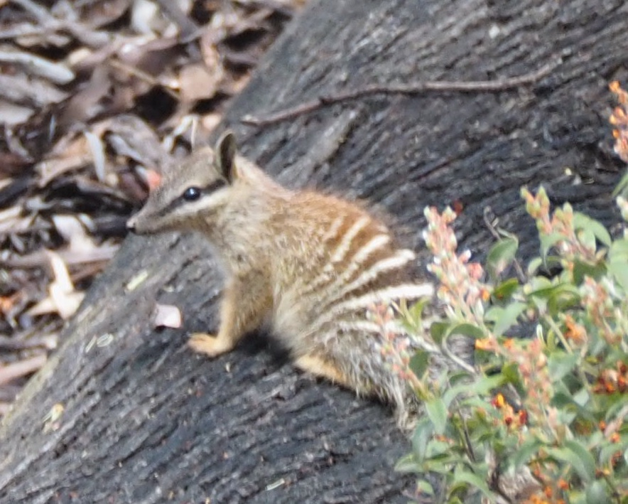

# Numbats in Australia

The data this week comes from the [Atlas of Living Australia](https://www.ala.org.au). 

This [numbat page](https://bie.ala.org.au/species/https://biodiversity.org.au/afd/taxa/6c72d199-f0f1-44d3-8197-224a2f7cff5f) talks about these endangered species in greater detail.

A [csv](data/numbats.csv) file of numbat sightings is provided. The code to refresh the data is [here](code/data.R). 

Questions that would be interesting to answer are:

- Where do you find numbats in Australia?
- Was the distribution more widespread historically? (You may need to exclude zoo reported observations.)
- What time of day do numbat sightings occur?
- Are they more frequent in the summer or winter?
- Are numbats seen more on sunny and warm days than cloudy, wet, cold days?
- Do sightings happen more on week days than weekends?

 

Credit: [Di Cook](@visnut@aus.social) and [H. Sherry Zhang](huizezhang-sherry) and Di Cook took these photos on a recent visit to WA.